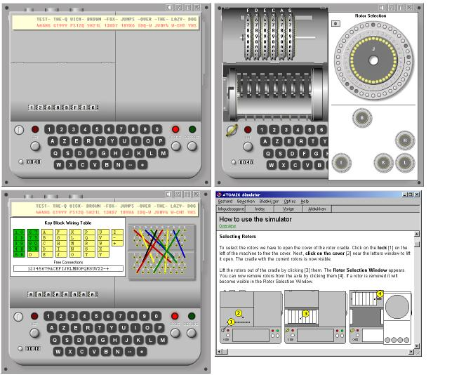



## ATOMIX Virtual Cipher Machine

### Description

The brandnew ultra realistic ATOMIX virtual cipher machine is finished! After the Award Winning Enigma and M-209 simulators this is the third software cipher machine that makes you feel like a real cryptologist. The ATOMIX cipher machine is an advanced virtual Cold War era electro-mechanical rotor machine, situated between the Enigma and the Fialka M-125. With its eight irregular stepping rotors, moving in both directions, the ATOMIX has a far better cryptographic strength as the Enigma and has a tremendous key space. Its flexible pin settings provide many more different rotor movements than the Fialka. This very realistic virtual ATOMIX enables you to encipher and decipher messages and apply the key settings as you would with an actual machine. The sim has a great 'look' and 'feel' with detailed GUI. There's also a Formatted Clipboard and Autotyping Function. The program has a very complete helpfile, containing the manual, the enciphering procedures and all technical details on the machine. Complete program, ready to use! All comments and feedback most welcome and...if you like it, vote it Freeware download also available at http://users.telenet.be/d.rijmenants *** Updated to v2.1 Oct 30, 2007 ***
 
### More Info
 

             |
---                |---
**Submitted On**   |2007-08-23 17:52:02
**By**             |[D\. Rijmenants](https://github.com/Planet-Source-Code/PSCIndex/blob/master/ByAuthor/d-rijmenants.md)
**Level**          |Intermediate
**User Rating**    |5.0 (169 globes from 34 users)
**Compatibility**  |VB 5\.0, VB 6\.0
**Category**       |[Encryption](https://github.com/Planet-Source-Code/PSCIndex/blob/master/ByCategory/encryption__1-48.md)
**World**          |[Visual Basic](https://github.com/Planet-Source-Code/PSCIndex/blob/master/ByWorld/visual-basic.md)
**Archive File**   |[ATOMIX\_Vir20890310302007\.zip](https://github.com/Planet-Source-Code/d-rijmenants-atomix-virtual-cipher-machine__1-66151/archive/master.zip)

